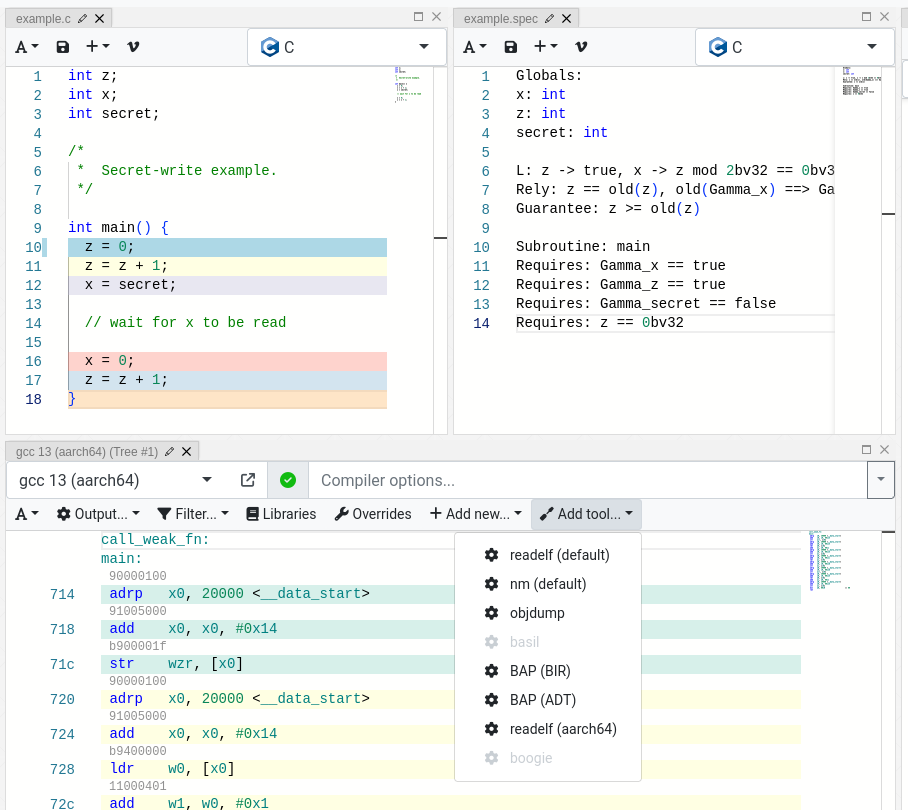
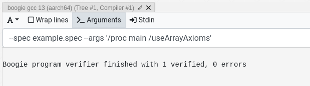
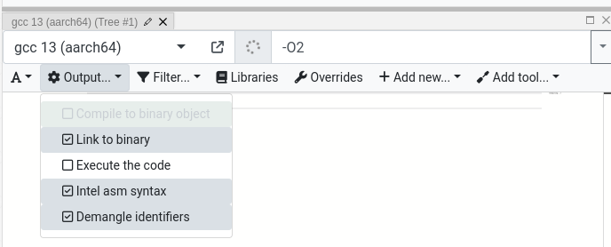

# Compiler-Explorer

Point of contact: @ailrst @katrinafyi

This includes explanation of the [Godbolt / compiler-explorer](compiler-explorer.com) wrapper for Basil.

The tool is available at [https://nationally-usable-bull.ngrok-free.app/](https://nationally-usable-bull.ngrok-free.app/).
The strange url is since it's the free randomly generated url from ngrok, the service I used to reverse proxy
the website from a spare laptop.
You must be a member of this Github org in order to be gain access to it.

To run the Godbolt container locally, see [pac-nix](https://github.com/katrinafyi/pac-nix/blob/main/DOCKER.md).

#### Using the tool

1. When you visit the page it will ask for a GitHub login since it only allows access if you are a member of the UQ-PAC GitHub org.
    - If you are trying to follow a link to a specific example the query params for the example get dropped by the login page so you will have to click the link again.
2. It defaults to a C++ template which isn't configured with any of the tools, go to templates in the top left and choose the "Secret Write Spec" template.
    - This has a C file and a spec file you can edit to test.

The way compiler-explorer works is with a simple pipeline

    Source Tree   ->    Compiler     ->     Tool

    example.c           gcc/clang           basil etc
    example.spec
        |                  |                    |
        v                  v                    v
     Editor              Assembly             Tool
     windows             Window               Windows

- This means every tool belongs to a compiler/assembly window,
and every compiler/assembly window belongs to a source tree or source
window.
    - This is indicated in the default pane names
    - You can have multiple pipelines run at the same time in different windows,
      eg. two different compilers on the same source.

3. To view other tool outputs; go to the Tools dropdown in the assembly output window to add another tool
  parented to this compiler/assembler.

The notable tools are:

- `BASIL (.bpl output)` - run ddisasm, readelf and basil and output the boogie file
- `BASIL (IL output)` - run ddisasm, readelf and basil and output the Basil IL file
- `readelf (aarch64)`  - output of `aarch64-linux-gnu-readelf -s -r -W`
- `BASIL (Boogie verifier)` - run readelf, bap, basil and boogie on the result

#### Tool Arguments

- If you modify the arguments for a tool, compiler, or the source code the entire pipeline will be re-run. No window is updated until every tool is finished,
  this can be a long time if you are running boogie.

- Note that while tools are parented to a compiler and source window, they do not talk to each other.
- Any extra tool arguments must be set in the `.env` file to make sure they are picked up by all windows.
- Tools also don't automatically know to use a spec file if it is available, **the spec file must be set in `basil_args` in the `.env` file**.
- Arguments can be explicitly passed to underlying tools by defining the relevant `_args` variable in the `.env` file.
- If you revert a source or argument change to exactly the same as a previous state a cached output may be used.

#### Compiler Arguments

- You can set compiler arguments in the assembly window, for example `-O2`.
- The tool does not work well unless the binary is compiled **and linked**.
  You must have `Link to binary` checked in the output menu for it to work.

#### Running Boogie Directly

1. Open a new source editor (Add → Source Editor)
2. Change the language to "Boogie IVL"
3. Add boogie code to the window
4. In the source editor, add a compiler (+ Add new → Compiler)
5. To pass extra arguments to boogie you need to pass then through by putting `--args '/arg1 /arg2'` in the Arguments
   field in the compiler window.

#### Sharing/Saving Examples

The share button in the top right allows sharing examples. "Short links" aren't guaranteed to live forever, but the "Full Link"
encodes the example in the actual url, so should be pretty reliable unless the URL is very large.

The Tree window also allows you to save or import the tree as a zip.

