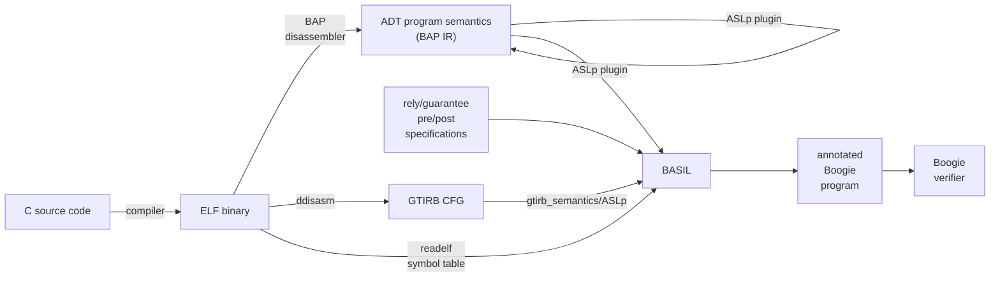

# BASIL Onboarding

## Background

BASIL is a program verification tool that operates on binaries. It implements a specific program logic
for verifying information flow on concurrent code.

## BASIL tool overview



BASIL works by translating a binary program to the Boogie Intermediate Verification Language. In doing so,
it additionally inserts assertions and specifications to make boogie check the ${wp_{if}^{\cal R G}}$ information-flow
security property.

### wpifRG

${wp_{if}^{\cal R G}}$ is the program logic BASIL implements for information flow verification. It is described in 
the paper by [Winter, Coughlin, Smith '21 in CSF](https://github.com/UQ-PAC/wpif_CSF21/blob/main/WinterCoughlinSmith_CSF2021.pdf).

Broadly, we consider information leaks under shared memory communication of parallel processes.
A "leak", is some secret information being stored somewhere it is not allowed to be.

Therefore for each potentially-shared variable we have 

1. $\cal L(var)$, security classification; the specification of what security levels a variable is allowed to store. A function from variables to a security classification (high or low), which may depend on the values of other program variables.
2. $\Gamma_v$, security value; a ghost-state variable storing the current security value of a variable, 
    that is the security value of whatever was last stored to the variable. Security levels
  flow in accordance with the flow of information in their corresponding program variables.

For example consider the following trace, where x begins with non-secret information, but is allowed 
to store secret information:

```
program        |    state after
x := 0         |  x = 0,  Gamma_x = low, secret = ?, Gamma_secret = high, L(x) = L(secret) = high
x := secret    |  x = ?, Gamma_x = high, secret = ?, Gamma_secret = high, L(x) = L(secret) = high
...
```

This program would not be secure if the classification was instead `L(x) = low`, since the assignment of 
secret would be a violation of this classification.

WpifRG checks the invariant that for all variables $v$ and program states ${\cal L}(v) \ge \Gamma_v$. 
The full description of this can be found in a paper available on request.

---

Note that we precisely use the term "shared" to mean variables that may be shared between threads, 
and "global" merely refers to their language scoping.

###  Static Analysis / Theory of Abstract Interpretation

- SPA:  https://cs.au.dk/~amoeller/spa/spa.pdf
- AI tutorial https://www-apr.lip6.fr/~mine/publi/article-mine-FTiPL17.pdf 
- https://www.youtube.com/watch?v=FTcIE7uzehE&list=PLtjm-n_Ts-J-6EU1WfVIWLhl1BUUR-Sqm&index=27

### BASIL Phases of translation

1. Lifting. 
    The binary we analyse is disassembled and lifted. This involves two processes
    1. The reconstruction of control flow. For this a disassembler is used, such as bap or ddisasm.
    2. The extraction of instruction semantics, this is the responsibility of [aslp](https://github.com/UQ-PAC/aslp), 
    as it is invoked by either a bap plugin or [gtirb-semantics](https://github.com/UQ-PAC/gtirb-semantics). 
    This operation is external to BASIL, and the details are available in the relevant code repositories. 

2. Parsing
    - The lifted program is parsed into a **BASIL IR** program.
    - The ELF symbol table data is loaded from the `.relf` text file and used to parse the `.spec` specification file
    - The specifications are loaded from the spec file for use in stage 4.
3. Analysis
    - Static analysis over the BASIL IR collects information used for translation.
    - The goal is to lift the program constructs present to constructs that afford more local reasoning.
4. Translation & Verification condition generation 
    - Verification conditions implementing the ${wp_{if}}^{\cal R G}$ logic, based on the function and rely/guarantee specifications 
    from the `.spec` file are added to the program when it is translated to the **Boogie IR**.
5. Verification
  - The Boogie IR program is serialised, and run through the boogie verifier.

See [RunUtils.scala](../src/main/scala/util/RunUtils.scala) where this is organised, for more detail.

### Internal Representations

- BASIL IR: Details can be found [here](basil-ir.md)
- Boogie IR: The Boogie AST represented within basil
- BAP ADT AST: Representation of the BAP in BASIL's frontend, before translation to BASIL IR

## Scala

Basil is implemented in Scala 3.
Scala is a mixed functional and object-oriented programming language implemented on the JVM. It is a very complicated 
language with a lot of depth, so it is important to carefully chose the implementation complexity introduced. 

Generally, this means favouring simple standard solutions and choosing functional programming in the small scale 
(use filter and map rather than loops), and object-oriented programming in the large scale. 

It is recommended to explore the [Scala documentation](https://docs.scala-lang.org/scala3/book/introduction.html).

Some general advice:

- Prefer [Enums](https://docs.scala-lang.org/scala3/book/types-adts-gadts.html) over inheritance trees
- Use functional programming over imperative wherever possible
- Prefer immutable case classes to regular classes wherever possible
- Don't unneccessarily use generics or type aliases 
- Correct code should not require explicit casts (`.asInstanceOf`)

#### Code style

We do not have a strict code style however 

- Use two spaces for indentation
- Use `{}` braces rather than purely indentation-based scoping


## Development tasks

### Debugging

- dumping the IR
- dumping an analysis result

## Writing Tests


### Unit tests

We use the [scalatest](https://www.scalatest.org/) unit testing framework. Example unit tests can be found in [src/test/scala](../src/test/scala/).

The [dsl](basil-ir.md#constructing-programs-in-code) can be used to construct simple example BASIL IR programs, which can then be fed through into the whole pipeline via `IRLoading.load()` in
`RunUtils.scala`. Prefer to write tests that depend only on the single piece of code under test rather than the whole BASIL translation. 

### Integration tests

These are the `SystemTests.scala` test case with the files present in `src/test/correct` for examples that should verify and `src/test/incorrect`
for examples that should not verify. 

These are lifted via the Makefiles, to add another test simply add a directory, c source file, and optionally specification file and run
The `config.mk` file in the test directory can be used to exclude unnecessary compiler options. 

```
$ cd src/test/
$ make
```

### Performance profiling

The performance target for the static analyses is that we can run through the entire 
[cntlm](https://github.com/versat/cntlm) binary in a reasonable amount of time (seconds),
depending on the expected performance of the analysis involved. 
Loading cntlm requires increasing the heap size by providing the `-Xmx8G` flag.

IntelliJ professional (which can be obtained for free by students) includes a performance profiler.

Alternatively, [async-profiler](https://github.com/async-profiler/async-profiler) can be used to produce a 
[flame graph](https://brendangregg.com/flamegraphs.html) showing the hot-spots in the program. Download the library from 
the releases tab, compile a basil .jar and run the jar with the following arguments.

Instructions for Linux and Mac:

```
mill assembly
java -agentpath:$YOUR_PATH/async-profiler-2.9-linux-x64/build/libasyncProfiler.so=start,event=cpu,file=profile.html -Xmx8G -jar out/assembly.dest/out.jar -i examples/cntlm-new/cntlm-new.adt -r examples/cntlm-new/cntlm-new.relf --analyse;
```

You may have to give it permission to collect perf events

```
sudo sysctl kernel.perf_event_paranoid=1
sudo sysctl kernel.kptr_restrict=0
```

## Prior Work

Inasfar as BASIL is a program analysis tool written in Scala, that operates by translating programs to boogie, there is Viper, and Vercors based on viper.

- [Viper](http://viper.ethz.ch/tutorial/) -- ETH Z
- [Vercors](https://github.com/utwente-fmt/vercors/wiki) -- U Twente 

A tutorial 

- https://continuation.passing.style/blog/writing-abstract-interpreter-in-scala.html

