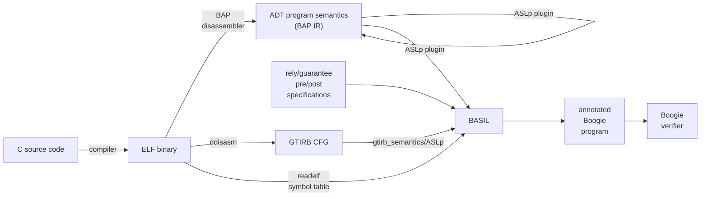

# BASIL Onboarding

## Background

BASIL is a program verification tool that operates on binaries. It implements a specific program logic
for verifying information flow on concurrent code.

### wpifRG

${wp_{if}^{\cal R G}}$ is the program logic BASIL implements for information flow verification. It is described in 
the paper by [Winter, Coughlin, Smith '21 in CSF](https://github.com/UQ-PAC/wpif_CSF21/blob/main/WinterCoughlinSmith_CSF2021.pdf).

Broadly, we consider information leaks under shared memory communication of parallel processes.
A "leak", is some secret information being stored somewhere it is not allowed to be.

Therefore for each potentially-shared variable we have 

1. $\cal L(var)$, security classification; the specification of what security levels a variable is allowed to store. A function from variables to a security classification (high or low), which may depend on the values of other program variables.
2. $\Gamma_v$, security value; a ghost-state variable storing the current security value of a variable, 
    that is the security value of whatever was last stored to the variable. Security levels
  flow in accordance with the flow of information in their corresponding program variables.

For example consider the following trace, where x begins with non-secret information, but is allowed 
to store secret information:

```
program        |    state after
x := 0         |  x = 0,  Gamma_x = low, secret = ?, Gamma_secret = high, L(x) = L(secret) = high
x := secret    |  x = ?, Gamma_x = high, secret = ?, Gamma_secret = high, L(x) = L(secret) = high
...
```

This program would not be secure if the classification was instead `L(x) = low`, since the assignment of 
secret would be a violation of this classification.

WpifRG checks the invariant that for all variables $v$ and program states ${\cal L}(v) \ge \Gamma_v$. 
The full description of this can be found in a paper available on request.

---

Note that we precisely use the term "shared" to mean variables that may be shared between threads, 
and "global" merely refers to their language scoping.

## BASIL tool overview



BASIL works by translating a binary program to the Boogie Intermediate Verification Language. In doing so,
it additionally inserts assertions and specifications to make boogie check the ${wp_{if}^{\cal R G}}$ information-flow
security property.

### BASIL Phases of translation

1. Lifting. 
    The binary we analyse is disassembled and lifted. This involves two processes
    1. The reconstruction of control flow. For this a disassembler is used, such as bap or ddisasm.
    2. The extraction of instruction semantics, this is the responsibility of [aslp](https://github.com/UQ-PAC/aslp), 
    as it is invoked by either a bap plugin or [gtirb-semantics](https://github.com/UQ-PAC/gtirb-semantics). 
    This operation is external to BASIL, and the details are available in the relevant code repositories. 

2. Parsing
    - The lifted program is parsed into a **BASIL IR** program.
    - The ELF symbol table data is loaded from the `.relf` text file and used to parse the `.spec` specification file
    - The specifications are loaded from the spec file for use in stage 4.
3. Analysis
    - Static analysis over the [BASIL IR](basil-ir.md) collects information used for translation.
    - The goal is to lift the program constructs present to constructs that afford more local reasoning.
4. Translation & Verification condition generation 
    - Verification conditions implementing the ${wp_{if}}^{\cal R G}$ logic, based on the function and rely/guarantee specifications 
    from the `.spec` file are added to the program when it is translated to the **Boogie IR**.
5. Verification
    - The Boogie IR program is serialised, and run through the boogie verifier.

See [RunUtils.scala](../src/main/scala/util/RunUtils.scala) where this is organised, for more detail.


###  Static Analysis / Theory of Abstract Interpretation

Basil uses static analysis over the BASIL IR, to "lift" the program to a more abstract representation, 
where we can make stronger assumptions about the code that make local reasoning more effective,
and hence verification easier.

This includes data-flow analyses based on the theory of Abstract Interpretation, as well 
as constraint-based analyses. 

- SPA:  https://cs.au.dk/~amoeller/spa/spa.pdf
  - Course textbook for CSSE4630, has a good introduction to lattice theory and dataflow analyses, the later 
    chapters (Distributive and later) are less relevant. 
- AI tutorial https://www-apr.lip6.fr/~mine/publi/article-mine-FTiPL17.pdf 
- Lecture series on AI https://www.youtube.com/watch?v=FTcIE7uzehE&list=PLtjm-n_Ts-J-6EU1WfVIWLhl1BUUR-Sqm&index=27
- Scala tutorial for a toy language https://continuation.passing.style/blog/writing-abstract-interpreter-in-scala.html

### Internal Representations

- [BASIL IR](basil-ir.md)
  - Basil IR is what you will be working with if you are implementing static analyses
- Boogie IR
  - The Boogie AST represented within BASIL's backend
- BAP ADT AST: Representation of the BAP in BASIL's frontend, before translation to BASIL IR

# Development

- [Development Guide](development)

## Prior Work

Inasfar as BASIL is a program analysis tool written in Scala, that operates by translating programs to boogie, there is Viper, and Vercors based on viper.

- [Viper](http://viper.ethz.ch/tutorial/) -- ETH Z
- [Vercors](https://github.com/utwente-fmt/vercors/wiki) -- U Twente 
- [TIP](https://github.com/cs-au-dk/TIP/tree/master) static analysis tool basil's static analyses are based on. It 
  is primarily an educational implementation, so is useful for understanding the algorithms but is not a performance baseline.


