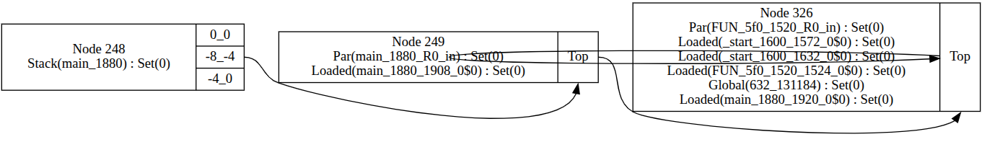

# Data Structure Analysis

Data Structure Analysis is a field- and context-sensitive pointer analysis [[Lat05]](https://llvm.org/pubs/2005-05-04-LattnerPHDThesis.pdf).
It overapproximates the set of fields of memory objects used in memory operations
as well as the set of fields of memory objects whose addresses may be held by each field.
The points-to relations are defined over fields of objects rather than the objects themselves granting
the analysis more precision.
Each memory object in the program is abstracted using a Data Structure Node.
That is all DSA (dynamic single assign) variables in the program and all memory allocations on the heap or stack
correspond to a field in a data structure node.
Nodes can be unified as a result of memory operations to represent more than one memory object.
The nodes and the points-to edges between them form a Data Structure Graph (DSG)
which is points-to graph with additional information (see [[Lat05]](https://llvm.org/pubs/2005-05-04-LattnerPHDThesis.pdf) for more details).
DSA is flow-insensitive and unification based. This allows for partial processing
of memory constraints concerning a memory object which can later be completed
as more information about the context (calling/global context) is discovered.
This partial processing is done in phases.

The recommended way to use dsa is with flags `--simplify --dsa= --dsa-split --dsa-checks`

### Symbolic Value Analysis
The pre-pass for dsa is made up of two components.
1. `SymbolicValueAnalysis` which is an
   intraprocedural value analysis where a DSA (Dynamic Single Assign) variable corresponds to a value that is represented using a
   symbolic base and some offset.

2. `data_structue_analysis.generateConstraints` which generates
   `MemoryAccessConstraint`s and `CallConstraint`s using the symbolic values corresponding to each DSA variable used in
   memory operations or as parameters to procedure calls.

### Local Phase
`MemoryAccessConstraints` capture the constraints on program memory which relate to program
operations in a given procedure. The local phase of DSA then processes these constraints
in-order to produce local DSG for every procedure in the program.

### Bottom-Up Phase
In this phase the call graph is traversed using postorder traversal and `CallConstraint`s
are processed by cloning the nodes (corresponding to
formal parameters and any pointees reachable from parameters) from the callee into the caller's graph
and unifying them with appropriate nodes in the caller (corresponding to actual parameters).
At the end of this phase each procedure's DSG has the context of all the
procedures it calls.

### Top-Down Phase
In this phase the call graph is traversed using reverse postorder traversal (reverse order as BU phase).
In this phase `CallConstraint` are reprocessed. Instead of cloning formal parameter nodes from callee into the caller
and unifying them with actual parameter nodes, nodes from the caller are cloned into the callee
to complete the context of the callee DSG with calling context.


## IntervalDSA
There are two implementations of Data Structure Analysis in BASIL.

The recommended implementation can be found at `data_structure_analysis.IntervalDSA`.
This implementation relies upon the transforms from simplification
pass (e.g. parameter form, dynamic single assign form, copy prop) which can be enabled
using the `--simplify` flag.

DSA itself can be enabled with default settings via the `--dsa=` flag. This
equivalent to providing the default argument `--dsa=td` for performing DSA up to and including
the top-down phase. Other options include `pre|local|bu` where `pre` only performs the sva and
constraint generation. And `local` and `bu` perform only the corresponding phases in the dsa
(e.g `bu` will do prepass, local and bottom-up phase but not the top-down phase).

The flag `--dsa-checks` can be used to enable additional runtime checks for DSA. These checks include 
checking that all `MemoryConstraints` have been maintained after each phase and that all expressions 
have a unique corresponding Node/Cell in each data structure graph. 

DSA includes the ability to use the symbol table entries to split the global memory.
By default, all global variables are represented using a single data structure node. That is if the program
has two global variables x and y. x and y will be fields of the same node in BASIL's DSA.
This choice was made since it makes it easier to handle overlapping accesses (e.g a memory access which reads values
of x and y from memory using a single read operation).
However, this causes a significant loss in precision if the global node loses field-sensitivity.
For example, a global address is accessed using a statically indeterminable offset.
The analysis won't be able to determine which field is accessed and hence has to unify all fields of an object
and treat them as one. This loss of field-sensitivity is extra costly if all global variables are fields of a node
and hence lose sensitivity when it is collapsed.
Instead, DSA could be configured to use the symbol table entries to split the globals into many nodes.
This can be enabled via the `--dsa-split` flag.


Below is an example program to demonstrate the effects of `--dsa-split`

```C
static int array[10] = {0, 1, 2, 3, 4, 5, 6, 7, 8, 9};
int x;
int *y;

int main(int r) {
    y = &x;
    return array[r];
}
```

The DSG for procedure main **without** `--dsa-split`:

The globals array, x and y are all represented via the same node (Node 236) and because r is indeterminable 
the node loses field sensitivity and collapses. 
With `--dsa-split` enabled the DSG would be:

Now only the node corresponding to array (node 935) is collapsed in the globals. 
Nodes for x and y (nodes 584 and 585 respectively) maintain field-sensitivity.

Further `--dsa-asserts` could be used to insert asserts checking that the index of a memory 
access falls within the bounds of a node. In the example above, we expect the value of r to fall within 
0 and 9 inclusive. An accesses beyond this range could access another part of memory (e.g. access variable x)
and render the result of the analysis unsound. As such, there is the option to insert assertions 
to bound check the value of r. The appropriate bounds for the globals are 
determined from the symbol table. 

BASIL's dsa also allows for unifying two distinct fields in the same node while maintaining 
field sensitivity. This option can be enabled by including the flag `--dsa-eqv`. 
By default, DSA loses field-sensitivity for nodes which have two distinct fields unified. 
With `--dsa-eqv` enabled, DSA allows fields of a node to form equivalence classes. 
Fields which belong to an equivalence class can only have a single outgoing edge (single pointee). 
And any incoming edge to a member of the equivalence classes is treated as an incoming edge to all the members. 
This can be viewed 
as a partial loss of field-sensitivity.
That is a subset of fields in a node may be unified while maintaining field-sensitivity else where in the node.

Below is an example program which demonstrates the effects of `--dsa-eqv`. Note that 
the example blow doesn't have `--dsa-split` enabled and hence all global variables 
are represented as fields of a single node.

```C
int *x;
int *y;
int *z;
int *p;
int *q;

int main(int c) {
   int a;
   int b;
   if (c) {
     x = &a;
     z = &x;
   } else {
     y = &b;
     z = &y;
   }
   p = &q;
}
```
The default DSG for the above program is as follows:


Addresses of x and y are assigned to z in the different branches of the if statement 
resulting in the collapse of the global node since fields corresponding to x and y are unified. 
With `--dsa-eqv` enabled the DSG is as follows:


Note that in the figure above the fields are replaced by their corresponding variable names
for ease of demonstration. 

With eq classes enabled, unifying fields corresponding to x and y results in loss of field-sensitivity 
only for those fields while z,p and q are maintained as disjoint fields of the global node.
Since x and y are unified. Their outgoing edges also need to be unified. As mentioned before 
each equivalence class can only have a single outgoing edge. x has an outgoing edge to a and 
y has an outgoing edge to b. However, a and b are fields of the same node (node representing the stack of main).
As such their unification results in another equivalence class, this time for fields of 
the stack node.


The other implementation is part of --analyse and relies on static analysis from based on the TIP framework
and while still maintained is longer being actively developed.

