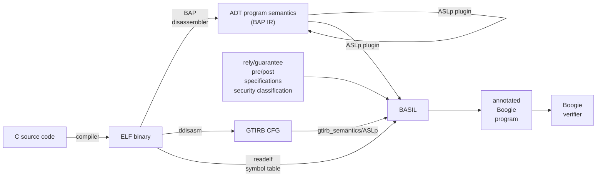

# Overview 

BASIL works by translating a binary program to the Boogie Intermediate Verification Language. In doing so,
it additionally inserts assertions and specifications to make Boogie check information-flow security as defined by \\(wp_{if}^{\cal R G}\\).

## Phases of translation

1. Lifting. 
    The binary we analyse is disassembled and lifted. This involves two processes
    1. The reconstruction of control flow. For this a disassembler is used, such as bap or ddisasm.
    2. The extraction of instruction semantics, this is the responsibility of [aslp](https://github.com/UQ-PAC/aslp), 
    as it is invoked by either a bap plugin or [gtirb-semantics](https://github.com/UQ-PAC/gtirb-semantics). 
    This operation is external to BASIL, and the details are available in the relevant code repositories. 

2. Parsing
    - The lifted program is parsed into a **BASIL IR** program.
    - The ELF symbol table data is loaded from the `.relf` text file and used to parse the `.spec` specification file
    - The specifications are loaded from the spec file for use in stage 4.
3. Analysis
    - Static analysis over the [BASIL IR](/basil-ir.md) collects information used for translation.
    - The goal is to lift the program constructs present to constructs that afford more local reasoning.
    - Simplifications (see [simplification-solvers](/development/simplification-solvers.md))
      - Parameter form
      - Dynamic Single Assignment
      - Simplifications (copyprop & branch condition simplifications)
4. Translation & Verification condition generation 
    - Verification conditions implementing the \\(wp_{if}^{\cal R G}\\) logic, based on the function and rely/guarantee specifications 
    from the `.spec` file are added to the program when it is translated to the **Boogie IR**.
5. Verification
    - The Boogie IR program is serialised, and run through the Boogie verifier.

See [RunUtils.scala](https://github.com/UQ-PAC/BASIL/tree/main/src/main/scala/util/RunUtils.scala) where this is organised, for more detail.

